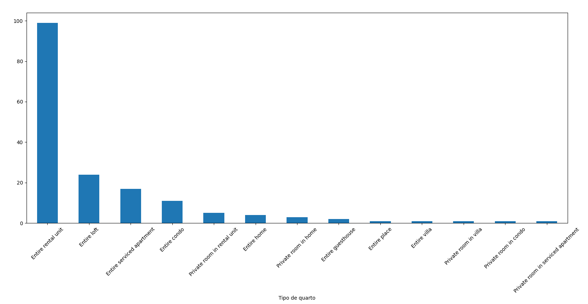

# Lista-de-Cafes

Tenho uma amiga que precisa ir à São Paulo constantemente a trabalho e acaba ficando refém dos preços de airbnb de última hora, além de não saber se seus cafés favoritos estão perto de onde ela vai passar as noite. O intuito do projeto é gerar uma base de dados contendo uma lista com os airbnb's dos bairros que ela frequenta, contendo a média da distância de uma lista de cafés prestigiados de SP, o estabelecimento mais perto e o preço da diária do airbnb.

## Início da modelagem

A base de dados utilizada foi extraída do [Apify](https://console.apify.com/) , que com poucos cliques podemos exportar uma base robusta contendo informações sobre moradias para aluguel em determinada cidade e em determinado período, no caso São Paulo. O arquivo gerado tem o nome de 'dataset_airbnb-scraper_2023-06-24_02-26-45-977'.

Importando os pacotes

```
import pandas as pd
import openpyxl
import matplotlib.pyplot as plt
```

Importando minha base de dados e transformando em data frame

```
airbnb_data = pd.read_excel("dataset_airbnb-scraper_2023-06-24_02-26-45-977.xlsx")
airbnb_df = pd.DataFrame(airbnb_data)
```
Como a base é grandes farei um subset coletando apenas as colunas de interesse

```
colunas_interesse = ["address", "location/lat", "location/lng", "url", "roomType", "stars",
                     "pricing/rateBreakdown/6/priceFormatted"]

airbnb_df_resumido = airbnb_df[colunas_interesse].copy()
print(airbnb_df_resumido.shape[0]) # -> atualmente com 2749 linhas
```
- As colunas escolhidas foram:
    - address: Contém o Bairro e a cidade
    - location/lat: coordenadas em latitude
    - location/lng: coordenadas em longitude
    - url: Link para o anúncio
    - roomType: Tipo do quarto
    - stars: Classificação
    - pricing/rateBreakdown/6/priceFormatted: Preço da diária formatado em R$

Existem bairros de interesse para a minha análise, por isso criarei uma lista com eles

```
airbnb_df_resumido[["Bairro", "Complemento"]] = airbnb_df_resumido["address"].str.split(",", n=1, expand=True)

bairros_interesse_lista = ["Vila Olímpia", "Vila Mariana", "Santo Amaro", "Moema", "Vila Madalena"]
bairros_interesse = airbnb_df_resumido["Bairro"].isin(bairros_interesse_lista)

print(airbnb_df_resumido[bairros_interesse].shape[0])

```

Criando um novo data frame aplicando os filtros

```
airbnb_sp = airbnb_df_resumido[bairros_interesse].copy()
```

Agora irei o levantamento das primeiras grandezas de interesse, começando pelo gráfico da distribuição de airbnbs por bairro.

```
airbnb_por_bairro = airbnb_sp['Bairro'].value_counts()
print(airbnb_por_bairro)
airbnb_por_bairro.plot(kind="bar", rot = 45)
plt.xlabel('Bairro')
plt.ylabel('Airbnbs')
plt.show()
```


Percebi que para extratir informações da coluna de preços seria necessário aplicar uma formatação para convertê-lo em float.
```
airbnb_sp["Preço formatado"] = (
    airbnb_sp["pricing/rateBreakdown/6/priceFormatted"]
    .str.lstrip('R$')
    .str.replace(",", ".")
    .astype(float)
)
```
Calculando agrupamentos por bairro
```
medias = airbnb_sp.groupby("Bairro")[["Preço formatado", "stars"]].mean().round(2)
print(medias)

```

     
A análise pelo rating(stars) é inconclusiva, mas foi possível ver que Vila Mariana possui a menor média de preço. Também será plotado o histograma por faixa de preço.

```
airbnb_sp["Preço formatado"].hist()
plt.xlabel('Distribuição de preço da diária')
plt.show()
```


A maior concentração de airbnbs nesses bairros possuem diária na faixa de 300 reais.
Por fim, esse data frame será exportado para calcular uma matriz de distâncias com uma lista de cafés.
```
nome_arquivo = "Airbnbs.xlsx"
airbnb_sp_vf.to_excel(nome_arquivo, index=False)
```
## Matriz de distâncias com API Google

A lista dos cafés escolhidos foi extraído do artigo [13 padarias em São Paulo que você precisa conhecer o quanto antes](https://www.guiadasemana.com.br/restaurantes/galeria/padarias-em-sao-paulo). 

Primeiramente, precisei encontrar os endereços dos airbnbs da filtragem anterior através das colunas de latitude e longitude.
```
# abrindo os arquivos

airbnb_df = pd.read_excel("Airbnbs.xlsx")
cafes_df = pd.read_excel("lista de cafes.xlsx")
airbnb_end_df = pd.read_excel("airbnbs_com_endereco_excel.xlsx")


# Inserindo API google

chave_google = CHAVE_AQUI

# Encontrando endereço dos cafes pelas coordenadas

def obter_endereco(lat, lng, chave_api):
    url = f'https://maps.googleapis.com/maps/api/geocode/json?latlng={lat},{lng}&key={chave_api}'
    response = requests.get(url)
    data = response.json()

    if response.status_code == 200 and data['status'] == 'OK':
        if len(data['results']) > 0:
            endereco = data['results'][0]['formatted_address']
            return endereco
    return None

latitude = airbnb_df["location/lat"]
longitude = airbnb_df["location/lng"]
api_key = chave_google
```

Depois, será criada a coluna "Endereço" no data frame de airbnbs

```
enderecos = []

for index, row in airbnb_df.iterrows():
    latitude = row['location/lat']
    longitude = row['location/lng']

    endereco = obter_endereco(latitude, longitude, api_key)
    enderecos.append(endereco)

airbnb_df['Endereço'] = enderecos
airbnb_df.to_excel('airbnbs_com_endereco_excel', index=False, engine='openpyxl')
```

Por fim, será gerado o output dessa etapa: uma matriz contendo os endereços dos airbnb nas colunas e os endereçõs dos cafés nas linhas. A matriz de distâncias é amplamente conhecida e como meu objetivo não era reiventar a roda, adaptei o código da [
Academia e Inteligência Artificial](https://www.youtube.com/watch?v=6oKl6mZXPIU)

```
# Començando as iterações e gerando a matriz

lista_distancia = []

for cafe in cafes_df["Endereço"]:
    lista_cafes = []
    for cord in airbnb_end_df["Endereço"]:
        origem = cord
        destino = cafe
        rota = "https://maps.googleapis.com/maps/api/distancematrix/json?" + 'origins=' + cord + '&destinations='+ cafe +'&key=' + chave_google
        req = requests.get(url=rota)
        req_json = req.json()
        distancia = req_json['rows'][0]['elements'][0]['distance']['value']
        lista_cafes.append(distancia)
    lista_distancia.append(lista_cafes)

matriz = pd.DataFrame(lista_distancia)

matriz.index = cafes_df["Estabelecimento"]
matriz.columns = airbnb_end_df["url"]


matriz.to_excel("distancias_vf.xlsx", index=False)
```

o outuput dessa etapa é o arquivo "distancias_vf.xlsx".

## Tratamento final

Para tratamento final, peguei algumas colunas do data frame de airbnbs e procurei juntá-las com informações empilhadas da matriz.
Criando um dicionário para empilhar informações da matriz.
```
matriz = pd.read_excel("distancias_vf.xlsx")
lista_cafes = pd.read_excel("lista de cafes.xlsx")
airbnb_1 = pd.read_excel("airbnbs_com_endereco_excel.xlsx")

# Criando dicionário vazio para agrupar as grandezas de interesse

lista_url = matriz.columns.to_list()
dict_dist = {}

# Definindo indices da matriz para os nomes dos estabelecimentos
id_matriz = matriz.set_index(lista_cafes["Estabelecimento"])

for url in lista_url:
    dict_dist = {
        "URL": lista_url,
        "dist_media": matriz.mean(axis=0).to_list(),
        "dist_min": matriz.min(axis=0).to_list(),
        "estabelecimento": id_matriz.idxmin(axis=0).tolist()
    }

df_url = pd.DataFrame(dict_dist)
```

- Foram criadas as colunas:
    - URL: empilhando as colunas da matriz
    - dist_media: media das distâncias de uma coluna, sendo que uma coluna contem a distância de um airbnb a todos os cafés da lista
    - dist_min: a menor distância presente na coluna
    - estabelecimento: o estabelecimento correspondente a menor distância
      
Complementando o data frame com informações da base original:
```
# Primeiro o preço
df_url["preco diaria"] = None

for index, row in df_url.iterrows():
    url = row["URL"]
    preco_diaria = airbnb_1.loc[airbnb_1["url"] == url, "Preço formatado"].values
    if len(preco_diaria) > 0:
        df_url.at[index, "preco diaria"] = preco_diaria[0]

# Também irei trazer o roomType para plotar algumas análises

df_url["tipo_quarto"] = None

for index, row in df_url.iterrows():
    url = row["URL"]
    tipo_quarto = airbnb_1.loc[airbnb_1["url"] == url, "roomType"].values
    if len(tipo_quarto) > 0:
        df_url.at[index, "tipo_quarto"] = tipo_quarto[0]
```
Por fim, salvando a base

```
df_url.to_excel("base_final.xlsx")
```

## Conclusões
Com um histograma é possível visualziar o estabelecimento que aparece mais vezes como distância mínima de cada airbnb
```
estab_freq = base_final['estabelecimento'].value_counts()
estab_freq.plot(kind="bar", rot=45)
plt.xlabel('Estabelecimentos')
plt.title('Frequência dos estabelecimentos em relação a menor distância')
plt.show()
```

     
A base possui a seguinte distribuição de tipos de quartos
```
tipo_quart_graf = base_final['tipo_quarto'].value_counts()
tipo_quart_graf.plot(kind="bar", rot=45)
plt.xlabel('Tipo de quarto')
plt.show()
```


O tipo de quarto de interesse é o modelo "Entire rental unit" ou Apartamento inteiro, portanto afunilaremos nele.
Plotando os histogramas por preço e distancia média:

```
base_final[base_final["tipo_quarto"]=="Entire rental unit"]["preco diaria"].hist()
plt.xlabel('Preço diária')
plt.show()
```


Existe uma feliz correlação entre preço médio e distância mínima

```
base_final[base_final["tipo_quarto"]=="Entire rental unit"]["dist_min"].hist(alpha=0.7)
plt.xlabel('Distância média [m]')
plt.show()
```


Por fim, o entregável final é a "base_final_ordenada.xlsx" contendo a relação de todos os airbnbs com as distâncias e os preços

```
base_final_only_ert = base_final["tipo_quarto"] == "Entire rental unit"
base_final_ordenada = base_final[base_final_only_ert].sort_values(['preco diaria', 'dist_min', 'dist_media'], ascending=[True, True])


print(base_final_ordenada.head())

base_final_ordenada.to_excel("base_final_ordenada.xlsx")
```


